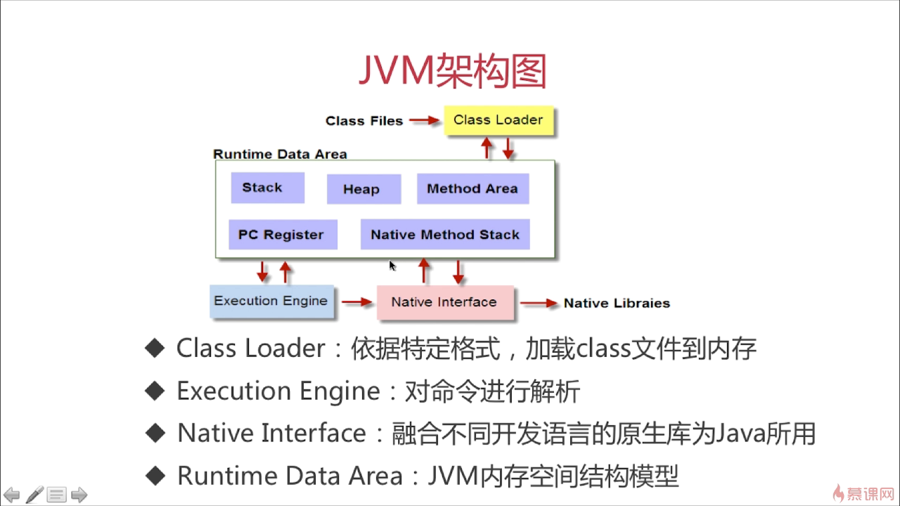

# JVM内存

逻辑地址、物理地址、线性地址、虚拟地址

======================================================
寄存器 缓存 内存：
	CPU <---> Register 寄存器<---> Cache 缓存 <---> Ram 内存 <---> Rom 硬盘
	从寄存器到硬盘，数据读取和存储速度依次降低，成本依次降低。

======================================================
操作系统内存：
	           分段管理机制         分页管理机制
	内存逻辑地址 ----------> 线性地址 ---------> 物理地址

======================================================

 

JVM加载class文件：

	Class Loader：根据特定格式加载class文件到内存；
	Execution Engine：对命令进行解析；
	Native Interface：调用非Java语言库，比如C/C++库。在 Runtime Data Area 中的 Native Stack 登记标记为 native 的方法，在 Execution Engine 执行时加载 Native Library
    一般JVM会通过加载、连接、初始化3个步骤来对该类进行初始化。其中连接分为验证、准备、解析。

系统内存

	Java内存模型受限于操作系统内存；
	32位CPU：2^32 可寻址范围（约3.9 GB）；
	64位CPU：2^64

地址空间划分：

	内核空间：
		主要的操作系统程序运行空间，包含C运行空间、调度程序、计算机硬件、提供联网和虚拟内存服务和基于C的进程等
	用户空间：
		用户实际运行时使用的内存空间；
		内存寻址空间知识不常问，作为拓展知识了解；

Java内存模型：Runtime Data Area

	jdk8:
		线程角度：
			线程私有：程序计数器，虚拟机栈，本地方法栈
			线程共有：元空间,堆和字符串常量池

    程序计数器：
	    当前线程执行字节码行号指示器（逻辑）；
	    通过改变程序计数器的值来选取下一条执行的字节码指令；
	    每条线程的程序计数器一一对应，即线程私有；
	    程序计数器是Java内存模型中唯一一块不会出现内存泄漏的区域；

    虚拟机栈：
	    方法执行时的运行区域；
	    虚拟机栈包含多个栈帧：
		    栈帧包含局部变量表，操作栈，动态链接，方法出口等。当方法执行完成时，该栈帧才会被销毁。
		    局部变量表雨操作数栈的交互：00006截图，局部变量表为操作数栈提供数据支持

> 问题：递归为什么容易导致StackOverFlowError?
> 递归深度太大，导致栈溢出

三大jvm调优参数：

	-Xss： 每个线程虚拟机栈的大小。
	-Xms： 堆空间初始值。
	-Xmx： 堆空间最大值。一般把-Xms和-Xmx设置成相同，避免堆内存不足发生扩容导致内存抖动影响程序运行稳定性。

    其他参数：
		-Xmn：堆中新生代的初始空间大小。
		-XX:NewRatio： 老年代和新生代（Eden + Survivor From + Survivor To）的比值（-XX:NewRatio=4 表示 新生代:老年代 = 1:4）
		-XX:SurvivorRatio： Eden区与Survivor区（Survivor From + Survivor To）的比值（-XX:SurvivorRatio=6 表示 Eden:Survivor From:Survivor To = 6:1:1）
		-XX:Newsize： 新生代初始值
	    -XX:Maxnewsize： 新生代最大值

Java内存模型中堆和栈的区别：

	程序运行时的内存分配策略：
		静态存储：
		栈式存储：
		堆式存储：

	堆栈联系与区别：
		引用对象、数组时，栈用定义变量保存堆中的首地址。
			举例：Person p1 = new Person();
			* new Person() 通过new开辟堆空间，调用无参构造创建一个对象实例，该实例存储在堆中;
			* p1变量是对象引用，保存在栈中，p1保存了实例对象的首地址;
			* 随着方法运行结束栈帧被销毁，栈帧中的引用变量占用内存空间被释放，但是堆中的实例对象并未立即被销毁，而是由GC收集器管理；
		两者的区别：
			内存管理：栈自动释放内存空间，堆由GC收集器管理；
			空间大小：栈空间一般比堆空间小；
			内存碎片：栈产生的碎片远小于堆产生的碎片；
			内存分配方式：栈支持静态和动态，堆只支持动态；
			效率：栈效率比堆高。栈只涉及到入栈和出栈两个指令，而堆动态分配能力比栈高，更灵活但是复杂度更高，效率不如栈。

元空间、堆、线程独占部分的联系——内存角度：

	元空间：保存类信息、方法、成员变量等
	堆：存放对象实例、数组等
	栈：引用变量

方法区：

	方法区与永久代的联系和区别：https://www.jianshu.com/p/66e4e64ff278
	方法区是jvm的规范，永久代和元空间都是方法区的具体实现，只是实现的方式有所不同。
	jdk7后方法区中的字符串常量池移动到堆中，字符串常量池存放在永久代中容易出现性能问题和内存溢出
	jdk8后移除永久代，采用元空间，永久代和元空间都是用来存储class信息。永久代采用jvm内存，元空间采用本地内存（系统内存）。

	元空间相对永久代的好处：
		1.极大减少永久代空间不足错误[java.lang.OutOfMemoryError:PermGen space]发生，因为元空间大小只受本地内存影响
		2.由于类和方法的信息大小难以确定，给方法区指定空间大小比较困难。
		3.永久代会增加GC复杂性。

jdk6 与 jdk7 intern() 区别：

