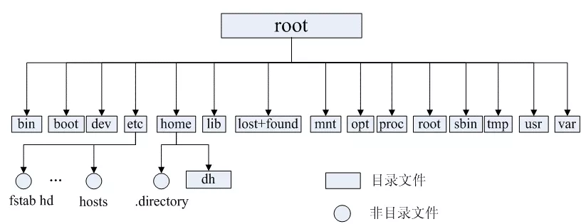

# Linux

# 操作系统

## 1. linux

### 1.1 Linux文件系统

在Linux操作系统中，所有被操作系统管理的资源，例如网络接口卡、磁盘驱动器、打印机、输入输出设备、普通文件或是目录都被看作是一个文件。LINUX系统中有一个重要的概念：一切都是文件。

**常见目录说明：**

* **/bin：** 存放二进制可执行文件(ls,cat,mkdir等)，常用命令一般都在这里；
* **/etc：** 存放系统管理和配置文件；
* **/home：** 存放所有用户文件的根目录，是用户主目录的基点，比如用户user的主目录就是/home/user，可以用~user表示；
* **/usr ：** 用于存放系统应用程序；
* **/opt：** 额外安装的可选应用程序包所放置的位置。一般情况下，我们可以把tomcat等都安装到这里；
* **/proc：** 虚拟文件系统目录，是系统内存的映射。可直接访问这个目录来获取系统信息；
* **/root：** 超级用户（系统管理员）的主目录（特权阶级^o^）；
* **/sbin:** 存放二进制可执行文件，只有root才能访问。这里存放的是系统管理员使用的系统级别的管理命令和程序。如ifconfig等；
* **/dev：** 用于存放设备文件；
* **/mnt：** 系统管理员安装临时文件系统的安装点，系统提供这个目录是让用户临时挂载其他的文件系统；
* **/boot：** 存放用于系统引导时使用的各种文件；
* **/lib ：** 存放着和系统运行相关的库文件 ；
* **/tmp：** 用于存放各种临时文件，是公用的临时文件存储点；
* **/var：** 用于存放运行时需要改变数据的文件，也是某些大文件的溢出区，比方说各种服务的日志文件（系统启动日志等。）等；
* **/lost+found：** 这个目录平时是空的，系统非正常关机而留下“无家可归”的文件（windows下叫什么.chk）就在这里。

## 1.2 常用Linux命令

###  目录

|命令|功能|
|:---|:---:|
|cd usr|切换到该目录下usr目录|
|cd ..|切换到上一层目录|
|cd /|切换至根目录|
|cd ~|切换到用户主目录|
|cd -|切换到上一个所在目录|
|mkdir 目录名称|创建目录|
|ls或者ll|查看目录信息；ll是ls -l的缩写，ll命令查看该目录下的所有目录和文件的详细信息|
|find 目录 参数|寻找目录（查）|
|mv 目录名 新目录名称|修改目录的名称（改）|
|mv 目录名 目录新位置|移动目录的位置---剪切（改）|
|cp -r 目录名 目标位置|拷贝目录（改），-r代表递归拷贝|
|rm [-rf] 目录|删除目录（删）|
|pwd|查看当前目录|

### **文件的操作命令（增删改查）**

| 命令                        |                             功能                             |
| :-------------------------- | :----------------------------------------------------------: |
| touch 文件名称              |                       文件的创建（增）                       |
| cat/more/less/tail 文件名称 | 文件的查看（查）；命令 tail -f 文件 可以对某个文件进行动态监控，例如tomcat的日志文件，可以使用tail -f catalina-2016-11-11.log 监控 文 件的变化； |
| cat                         |                     只能显示最后一屏内容                     |
| more                        | 可以显示百分比，回车可以向下一行， 空格可以向下一页，q可以退出查看 |
| less                        |     可以使用键盘上的PgUp和PgDn向上 和向下翻页，q结束查看     |
| tail-10                     |                 查看文件的后10行，Ctrl+C结束                 |
| vim 文件                    |                     修改文件的内容（改）                     |
| rm -rf 文件                 |                           删除文件                           |

###  压缩和解压

| 命令                                     |                          功能                          |
| :--------------------------------------- | :----------------------------------------------------: |
| tar -xvf test.tar.gz                     |             将test.tar.gz解压到当前目录下              |
| tar -xvf xxx.tar.gz -C /usr              | 将test.tar.gz解压到当前目录下（- C代表指定解压的位置） |
| grep 要搜索的字符串 要搜索的文件 --color |             搜索命令，--color代表高亮显示              |
| ps（Process Status）                     |                   显示所有进程的状态                   |
| ps -ef/ps aux                            | 两个都是查看当前系统正在运行进程，区别是展示格式不同。 |
|                                          |    ps aux\|grep redis （查看包括redis字符串的进程）    |
| kill -9 进程的pid                        |             杀死进程（-9 表示强制终止。）              |

###  网络

| 命令        |          功能          |
| :---------- | :--------------------: |
| ifconfig    | 查看当前系统的网卡信息 |
| netstat -an | 查看当前系统的端口使用 |
| ping        |                        |

###  开关机

| 命令                      |               功能               |
| :----------------------- | :----------------------------: |
| cd usr                    | 切换到该目录下usr目录 |
| count运算上的区别 |                                     |