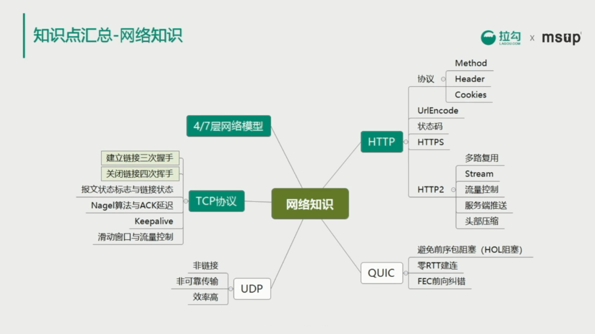
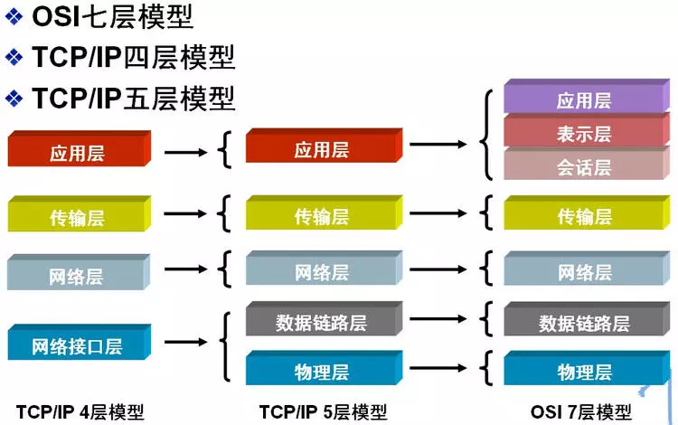
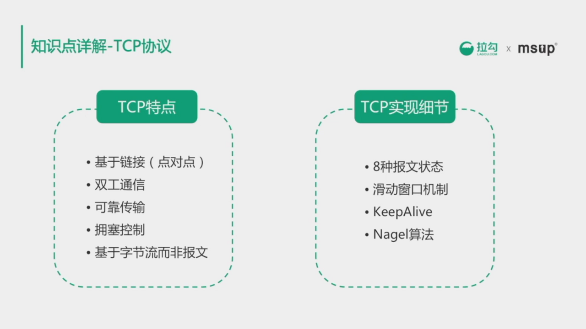
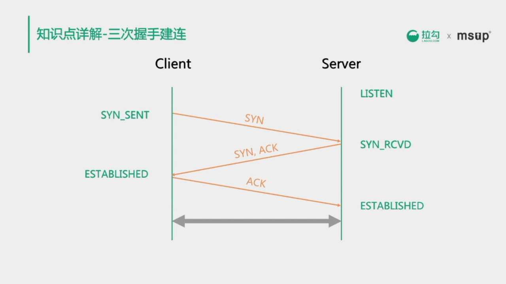
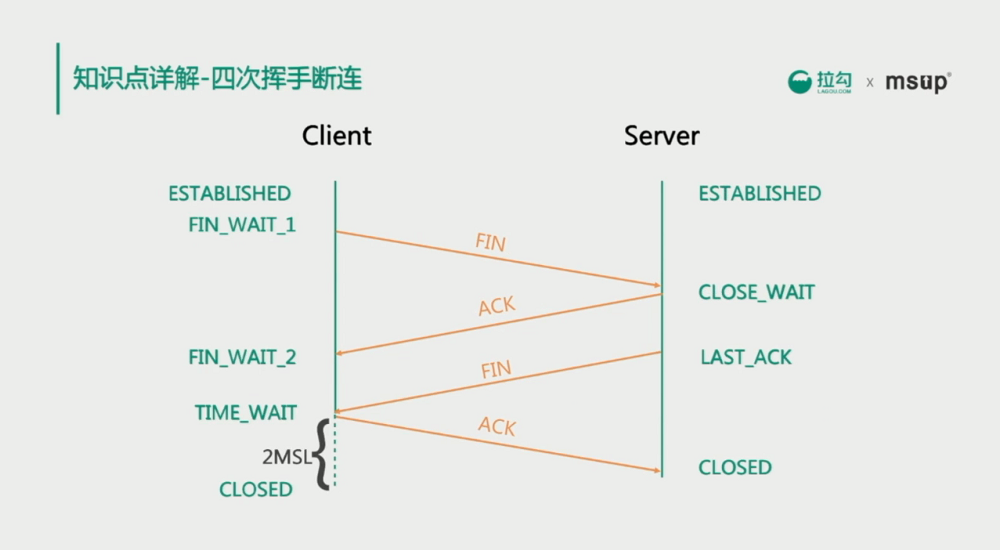
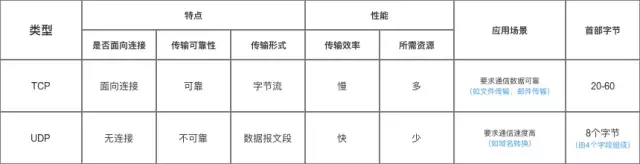
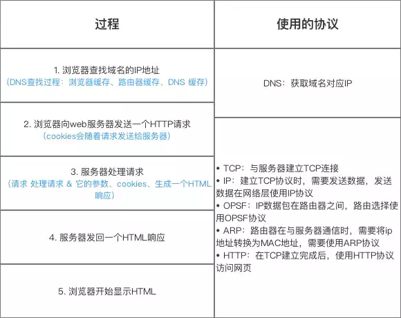
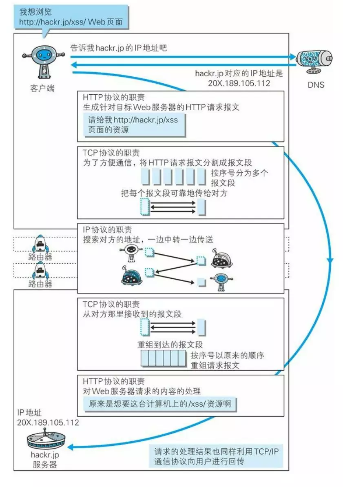

# 计算机网络

## 1. 计算机网络模型

## 2. TCP协议

**TCP特点**：tcp是传输层协议，对应OSI的传输层

* 基于链接（点对点）：连接数据前需要建立好链接才能传输
* 双工通信：链接建立好后可以双向通信
* 可靠传输
* 拥塞控制：解决因网络导致重传问题，进一步导致网络情况恶化
* 基于字节流而非报文

**TCP实现细节**：

* 8种报文状态
* 滑动窗口机制：通过滑动窗口控制数据的发送速率。滑动窗口实际上是动态缓冲区，接收端根据自己的数处理能力在TCP的 header 中动态调整窗口大小，通过ACK应答包通知给发送端，发送端通过窗口大小调整发送速度
* Nagel 和 ACK 延迟配合使用可能导致 ACK 延迟 40 ms 超时后 才能回复ack包

### 2.1 三次握手

TCP 是双工连接，不区分客户端和服务端，为便于讲解，把主动请求的一段成为 Client 端，被动简历连接的一段程为 Server 端。

建立链接前，server 端需要监听端口，处于 listen 状态；
Client 申请从 Client 到 Server 方向建立链接，向 Server 发送 SYN 同步包，发送后处于 SYN_SENT 状态；
server 收到 SYN 同步包后，同意建立链接后，向 Client 发送 ACK 并同时向 Client 发送 SYN 同步包，申请从 Server 端向 Client 端建立链接；发送完 ACK 和 SYN 后，Server 处于 SYN_Receive 状态；
Client 收到 Server 发送的 ACK 后，Client 变成 Established 状态，并向 Server 端发送 ACK 相应，回复 Server 端的 SYN 请求；
Server 端收到 Client 端的 ACK 后，Server 端状态变成 Established，到此链接建立完成，双方可以进行数据传输。

面试时要明白，三次握手的目的是建立双向链接，要知道 Client 和 Server 的状态变化。

**SYN 洪水攻击**
	发生的原因：Server 端收到 Client 端请求后，向 Client 发送 SYN 和 ACK，但 Client 迟迟不回复 ACK，导致 Server 端大量链接处在 SYN_Receive 状态，进而影响其他正常请求的建连。
	解决策略：
		1.设置 Linux 系统参数：tcp_synack_retries = 0，加快回收“半连接”；
		2.调大 Linux 系统参数：tcp_max_syn_backlog 来应对少量的洪水攻击。

#### 2.1.1 三次握手建立连接：

1. 第一次握手：客户端 – 发送带有 SYN 标志的报文 – 服务端 【确保客户端发送正常】
2. 第二次握手：服务端  – 发送带有 SYN / ACK 标志的报文 - 客户端 【确保客户端发送正常】
3. 第三次握手：客户端–发送带有带有 ACK 标志的报文 - 服务端

**三次握手目的：**
三次握手的目的是建立可靠的通信信道，说到通讯，简单来说就是数据的发送与接收，而三次握手最主要的目的就是双方确认自己与对方的发送与接收是正常的。

### 2.2 四次挥手

把先发起请求断开的一端成为 Client，被动一方称为 Server。

开始时双方都是 Established 状态；
Client 发起关闭连接请求，向 Server 发送 FIN 包，表示 Client 已经没有数据要传输，发送后 Client 处于 FIN_WAIT_1 状态；
Server 收到 FIN，返回 ACK，Server 状态变成 Close_Wait，此时 Server 处于半关闭状态，因为此时 Client 已经没有数据要发送，但是 Server 端可能还有数据要发送；
当 Server 端把剩余的数据发送完毕后，Server 向 Client 发送 FIN 表示 Server 端也没有数据要发送了，这时 Server 状态变成 Last_Wait，等待 Client 应答 ACK 即可关闭链接；
Client 端收到 FIN 后，向 Server 端发送 ACK，Client 状态变成 Time_Wait，进入 Time_Wait 状态后，Client 要等待 2 MSL（max segment lifetime 最大报文生存时间），保证链接可靠关闭，之后才能进入 Closed 状态；
Server 端收到 ACK 后。直接就进入 Closed 状态。

Client 为什么要等待 2 MSL 后才能关闭的原因：
	1.保证 TCP 协议全双工链接可靠关闭；
	2.保证这次连接中，重复的数据段从网络中消失，防止端口被重用的时候产生数据混淆。

建连时三次握手，断连时四次握手的原因：
	无论是建连还是断连，都需要在两个方向进行，只不过建连时，Server 段的 SYN 和 ACK 在两个包合并为一次发送；而断开链接时，两个方向的数据发送的停止时间可能是不同的，无法合并 FIN 和 ACK 为一次发送。

在实际应用中，有可能大量 socket 处在 Time_Wait 或 Close_Wait 的问题；
开启 Linux 系统的参数：tcp_tw_reuse 和 tcp_tw_recycle 能加快 Time_Wait 状态的回收；
出现大量 Close_Wait 一般是被动关闭的一方存在 bug 没有正确关闭链接导致。

#### 2.2.1 四次挥手断开连接：

1. 客户端-发送一个 FIN，用来关闭客户端到服务器的数据传送
2. 服务器-收到这个 FIN，它发回一 个 ACK，确认序号为收到的序号加1 。和 SYN 一样，一个 FIN 将占用一个序号
3. 服务器-关闭与客户端的连接，发送一个FIN给客户端
4. 客户端-发回 ACK 报文确认，并将确认序号设置为收到序号加1

#### 2.2.2为什么四次挥手：

任何一方都可以在数据传送结束后发出连接释放的通知，待对方确认后进入半关闭状态。当另一方也没有数据再发送的时候，则发出连接释放通知，对方确认后就完全关闭了TCP连接。

#### 2.2.3 为什么建立连接是三次握手，关闭连接确是四次挥手呢？

建立连接的时候， 服务器在LISTEN状态下，收到建立连接请求的SYN报文后，把ACK和SYN放在一个报文里发送给客户端。
而关闭连接时，服务器收到对方的FIN报文时，仅仅表示对方不再发送数据了但是还能接收数据，而自己也未必全部数据都发送给对方了，所以己方可以立即关闭，也可以发送一些数据给对方后，再发送FIN报文给对方来表示同意现在关闭连接，因此，己方ACK和FIN一般都会分开发送，从而导致多了一次。

### 2.3  报文状态标志与连接状态

TCP的报文状态标志与连接状态在排查网络问题时十分重要，需要明白协议状态才方便抓包分析

### 2.4 Nagel算法与ACK延迟

​	了解产生背景，需要解决小包问题，提高数据载荷比

​	对于延迟比较敏感且发生？？频率较低的场景可以关闭ng算法

### 2.5 TCP keepalive

### 2.6 滑动窗口与流量控制

## 3. UDP
TCP / UDP 区别：

## 4. HTTP

### 4.1 HTTP 内容

**Header**

**Method**

**cookies**

**状态码**

| 状态码 |                               含义                               |
| --------- | --------------------------------------------------------- |
| 1xx      | 请求正被处理                                                |
| 2xx      | 请求成功处理                                                |
| 3xx      | 请求需要附加操作，常见的例子如重定向        |
| 4xx      | 客户端出错导致请求无法被处理（前端问题） |
| 5xx      | 服务端处理出错                                            |

常见的状态码：

200 OK 请求成功。
204 No Content 没有新文档。浏览器应该继续显示原来的文档。如果用户定期地刷新页面，而Servlet可以确定用户文档足够新，这个状态代码是很有用的。
205 Reset Content 没有新文档。但浏览器应该重置它所显示的内容。用来强制浏览器清除表单输入内容。 
301 Moved Permanently 资源永久重定向。响应的头部字段Location中一般还会返回新一个地址。
**302  Found** 资源临时重定向。
304 Not Modified 资源未改变，可直接使用缓存。
400 Bad Request：请求头不正确、uri写错、请求方法错等。
401 Unauthorized 未经过认证。
**403 Forbidden** 禁止访问。
**404 Not Found** 服务端没有找到所请求的资源（一般这个错误是客户端的请求url写错了）。
422 Unprocessable Entity 请求格式正确，但是由于含有语义错误，无法响应。
500 Internal Server Error 服务器出错。
502 Bad Gateway 网关或代理服务器请求时，从上游服务器接收到无效的响应。
**503 Service Unavailable** 服务器暂时无法使用，可能是维护或者升级，反正无法使用。
504 Gateway Timeout 网关或代理服务器访问超时。

<https://segmentfault.com/a/1190000018264501>
<https://segmentfault.com/a/1190000006879700>

### 4.3 UrlEncode

### 4.4 HTTPS

### 4.5 HTTP keepalive

在HTTP/1.0中默认使用短连接。也就是说，客户端和服务器每进行一次HTTP操作，就建立一次连接，任务结束就中断连接。当客户端浏览器访问的某个HTML或其他类型的Web页中包含有其他的Web资源（如JavaScript文件、图像文件、CSS文件等），每遇到这样一个Web资源，浏览器就会重新建立一个HTTP会话。

而从HTTP/1.1起，默认使用长连接，用以保持连接特性。使用长连接的HTTP协议，会在响应头加入这行代码：Connection:keep-alive；在使用长连接的情况下，当一个网页打开完成后，客户端和服务器之间用于传输HTTP数据的TCP连接不会关闭，客户端再次访问这个服务器时，会继续使用这一条已经建立的连接。Keep-Alive不会永久保持连接，它有一个保持时间，可以在不同的服务器软件中设定这个时间。

## 5. HTTP2

## 6. QUIC（HTTP3）

quic基于UDP，但是提供了类似http的可靠性和流量控制

## 7. 其他常见问题

### 在浏览器中输入url地址到显示主页的过程

1. DNS解析 【缓存，host文件】
2. TCP连接
3. 发送HTTP请求
4. 服务器处理请求并返回HTTP报文
5. 浏览器解析渲染页面
6. 连接结束

DNS缓存：
DNS存在着多级缓存，从离浏览器的距离排序的话，有以下几种: 浏览器缓存，系统缓存，路由器缓存，IPS服务器缓存，根域名服务器缓存，顶级域名服务器缓存，主域名服务器缓存。

DNS存在着多级缓存，从离浏览器的距离排序的话，有以下几种: 浏览器缓存，系统缓存，路由器缓存，IPS服务器缓存，根域名服务器缓存，顶级域名服务器缓存，主域名服务器缓存。

DNS负载均衡：
DNS可以返回一个合适的机器的IP给用户，例如可以根据每台机器的负载量，该机器离用户地理位置的距离等等，这种过程就是DNS负载均衡，又叫做DNS重定向。CDN(Content Delivery Network)就是利用DNS的重定向技术，DNS服务器会返回一个跟用户最接近的点的IP地址给用户，CDN节点的服务器负责响应用户的请求，提供所需的内容。

### 各种协议与HTTP协议之间的关系

图片来源：《图解HTTP》

