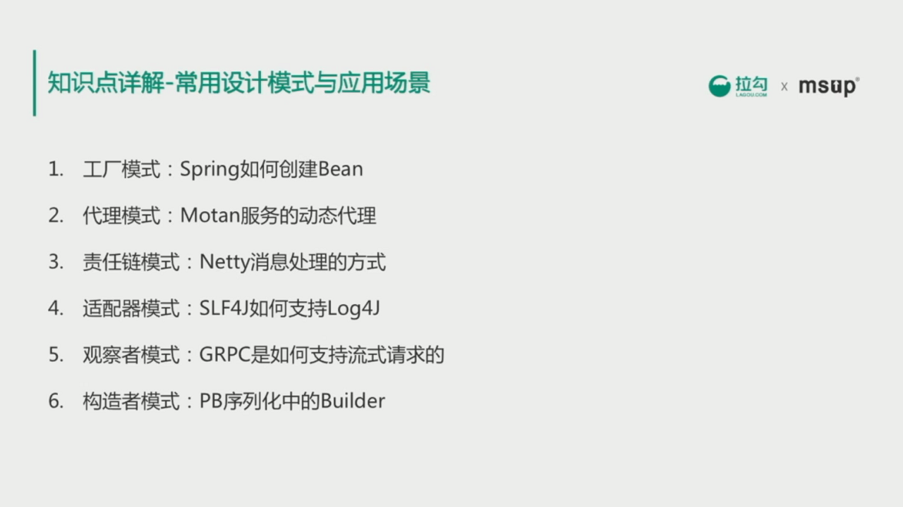

# 其他常见设计模式

 

* 工厂模式：创建不同实例时常用的方式。Spring 的各种 Bean 是由不同的工厂创建的。

* 代理模式：主要用在不适合或者不能直接引用另外一个实对象的场景，通过代理模式实现对被代理类进行行为访问的控制。Java 的代理模式分为**静态代理**和**动态代理**。

    静态代理：是指在编译时就创建好代理类。
    动态代理：是指在 JVM 运行中动态创建的代理类。实现动态代理的方式：
   1. jdk动态代理（基于接口）
   2. cglib动态代理（基于继承）
   3. javassist（hibernate中使用这种方式）

	RPC 框架就是使用动态代理技术，通过反射把远程请求进行封装，使服务看上去好就像在调用本地方法。

* 责任链模式：类似工厂流水线，链上某一个节点完成对对象的某一种处理。

* 适配器模式：适配与解耦。

* 观察者模式（发布订阅模式）：一个对象的某个行为要触发一些事件的场景。

* 构造者模式：一个对象有很多复杂属性，需要根据不同情况创建不同对象。