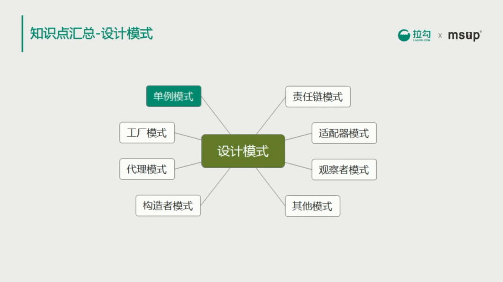

# 单例模式

 

## 单例模式的实现

* 静态初始化（饿汉式）：在类初始化时完成单例初始化的创建，因此不会产生并发问题。不管会不会使用到这个单例都会创建这个单例。线程安全。
* 双重检查（懒汉式）：只有在真正用到这个单例的时候才会创建这个单例，如果不使用就不会创建。但是会面临多线程同时使用产生的并发问题，需要使用 Synchronize 或者 Lock 进行双重检查，保证只有一个线程创建实例。这里要注意内存可见性引起的并发问题，必须使用 volatile 关键字修饰单例变量。
* 单例注册表：Spring 中的单例 Bean 就是使用单例注册表方式实现。

**静态初始化（饿汉式）**
~~~java
public class Singleton {
    private Singleton() {}//构造方法
    public static Singleton instance = new Singleton();//类加载时已经实例化
    //静态工厂方法
    public static Singleton getInstance() {
        return instance;
    }
    //业务代码
    public void otherMethod() {
        //...
    }
}
~~~

**双重校验锁**
~~~java
public class Singleton {
    private Singleton() {}//构造方法
    public volatile static Singleton instance;
    //第一次校验是为了当 instance!=null 时略过加锁代码提高性能
    if(instance == null) {
        synchronized (Singleton.class) {
            if(instance == null) {
				instance = new Singleton();
            }
        }
    }
    //业务代码
    public void otherMethod() {
        //...
    }
    return instance;
}
~~~

**枚举实现单例**
~~~java
//能避免多线程同步问题，防止反序列化重新创建新对象，防止通过暴力反射（reflection attack）获取私有构造方法创建新对象。
//单元素的枚举类型已经成为实现Singleton的最佳方法。”————《Effective Java》
public enum SingletonEnumContainer {
	CONTAINER;//唯一“实例”
    private Singleton singleton = null;
    private SingletonEnumContainer() {
		singleton = new Singleton();
    }
    public Singleton getInstance() {
        return singleton;
    }
}
//单例类
public class Singleton() {
	//业务代码
    public void otherMethod() {
        //...
    }
}
//调用单例实例
public class Test() {
	SingletonEnumContainer.CONTAINER.getInstance();
}
~~~

**单例注册表**
~~~java
public class Singleton extends SimpleAliasRegistry implements SingletonBeanRegistry {
    //通过 Map 实现单例注册表，考虑线程安全采用 ConcurrentHashMap
    private final Map<String, Object> singletonObjects = new ConcurrentHashMap<String, Object>(64);

    public Object getSingleton(String beanName, ObjectFactory<?> singletonFactory) {
        Assert.notNull(beanName, "'beanName' must not be null");
        synchronized (this.singletonObjects) {
            //检查缓存中是否存在实例  
            Object singletonObject = this.singletonObjects.get(beanName);
            if (singletonObject == null) {
                //...
                try {
                    singletonObject = singletonFactory.getObject();
                }
                catch (BeanCreationException ex) {
                    //...
                }
                finally {
                    //...
                }
                //如果实例对象在不存在，我们注册到单例注册表中
                addSingleton(beanName, singletonObject);
            }
            return (singletonObject != NULL_OBJECT ? singletonObject : null);
        }
    }

    protected void addSingleton(String beanName, Object singletonObject) {
        synchronized (this.singletonObjects) {
            this.singletonObjects.put(beanName, (singletonObject != null ? singletonObject : NULL_OBJECT));

        }
    }
}
~~~

单例还有其他的实现方式，参考：菜鸟教程-设计模式-单例模式
www.runoob.com/design-pattern/singleton-pattern.html

